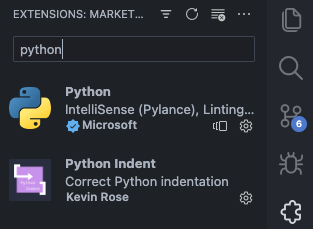
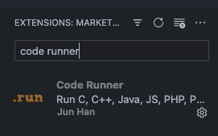

# Instalación

## Instalación de Python

Para instalar Python en Windows, se debe descargar la versión más
reciente de [Python](https://www.python.org/), en este caso la versión `3.12.0`.

## Instalación de Visual Studio Code

Para poder programar en Python, se puede utilizar cualquier editor de texto, en este caso se utilizará
[Visual Studio Code](https://code.visualstudio.com/), debido a que es un editor de texto gratuito y de código abierto y
tiene soporte para múltiples lenguajes de programación gracias a su gran cantidad de extensiones.

## Instalación de la extensión de Python para Visual Studio Code

Para poder programar en Python con Visual Studio Code, se debe instalar la extensión de Python para Visual Studio Code,
para ello se debe abrir Visual Studio Code y en la barra lateral izquierda se debe hacer clic en el ícono de
extensiones, o se puede utilizar el atajo de teclado `Ctrl + Shift + X`, luego en el buscador se debe escribir `Python`
y se debe hacer clic en el botón de instalar.

Además de la extensión de Python, se recomienda instalar la extensión de `Code Runner`, la cual permite ejecutar el
archivo de código que se está editando con un atajo de una manera más amigable que utilizando la terminal.

